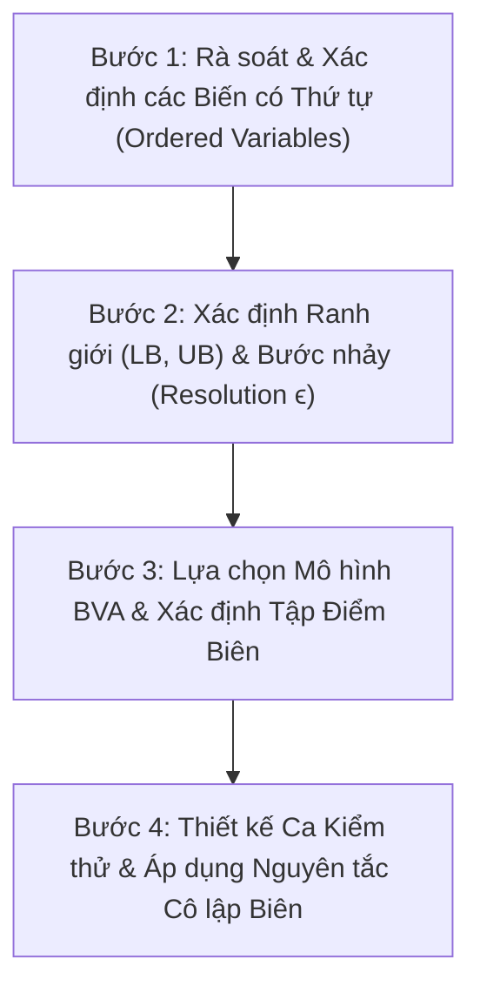

# Boundary Value Analysis Skill (Phân tích Giá trị Biên)

Kỹ năng này hướng dẫn quy trình từng bước áp dụng kỹ thuật **Boundary Value Analysis (BVA - Phân tích Giá trị Biên)** để thiết kế tập ca kiểm thử chuyên sâu nhằm phát hiện các lỗi ranh giới (boundary defects, off-by-one errors, toán tử so sánh sai) theo chuẩn bài giảng môn Kiểm thử Phần mềm trường ĐH Khoa học Tự nhiên (HCMUS).

---

## 1. Mục tiêu và Cơ sở Lý thuyết

- **Lý do cần BVA**: Kinh nghiệm thực tế và nghiên cứu kiểm thử cho thấy: **phần lớn lỗi nghiêm trọng của phần mềm xuất hiện tại hoặc ngay sát các đường biên của miền dữ liệu** (do lập trình viên nhầm lẫn giữa `<` và `<=`, gõ sai giá trị biên, hoặc lỗi tràn số).
- **Phạm vi áp dụng**: BVA **chỉ áp dụng khi miền dữ liệu có thứ tự (ordered domains)** (ví dụ: số nguyên, số thực, ngày/tháng/năm, độ dài chuỗi ký tự, số lượng phần tử trong giỏ hàng, số lần thử đăng nhập).
- **Mối quan hệ với Domain Testing**: BVA thường được áp dụng tiếp nối sau bước Phân hoạch tương đương nhằm bổ sung các ca kiểm thử nhạy cảm nhất quanh các ranh giới của các lớp tương đương hợp lệ và không hợp lệ.

---

## 2. Các Kỹ thuật & Mô hình Chọn Điểm Biên (BVA Models)

Theo bài giảng HCMUS, kiểm thử viên có thể lựa chọn giữa các kỹ thuật và mô hình kiểm thử biên sau:

### 2.1. Phương pháp 2 Điểm Biên (2-Point Boundary Value)
- Xét từng biên hợp lệ:
  - **Biên dưới (Lower Boundary - LB)**: Lấy $LB$ (Hợp lệ) và $LB - 1$ (Không hợp lệ).
  - **Biên trên (Upper Boundary - UB)**: Lấy $UB$ (Hợp lệ) và $UB + 1$ (Không hợp lệ).

### 2.2. Phương pháp 3 Điểm Biên (3-Point Boundary Value)
- Với mỗi biên danh nghĩa, kiểm tra 3 điểm kề nhau (bước nhảy $\epsilon$):
  - **Quanh Biên dưới LB**: $\{LB - \epsilon, LB, LB + \epsilon\}$ (ngoài biên, tại biên, trong biên).
  - **Quanh Biên trên UB**: $\{UB - \epsilon, UB, UB + \epsilon\}$ (trong biên, tại biên, ngoài biên).

### 2.3. Các Mô hình Đa biến (Multi-variable BVA Models)
Với hàm có $n$ biến đầu vào:
1. **Standard BVA ($4n + 1$ ca kiểm thử)**:
   - Dựa trên giả định lỗi đơn (Single Fault Assumption).
   - Với mỗi biến, kiểm tra 4 điểm biên: $\{min, min^+, max^-, max\}$.
   - Các biến còn lại được giữ cố định ở giá trị định danh bình thường (Nominal value).
   - Cộng thêm $1$ ca kiểm thử chuẩn khi tất cả các biến đều ở giá trị Nominal.
2. **Robustness Testing ($6n + 1$ ca kiểm thử)**:
   - Mở rộng từ Standard BVA, kiểm tra thêm 2 điểm ngoài biên vi phạm: $\{min^-, max^+\}$ cho mỗi biến.
3. **Worst-case Testing ($5^n$ ca kiểm thử)**:
   - Từ bỏ giả định lỗi đơn, kiểm tra tổ hợp của tất cả các biến tại 5 điểm $\{min, min^+, nom, max^-, max\}$.
4. **Robust Worst-case Testing ($7^n$ ca kiểm thử)**:
   - Tổ hợp toàn bộ 7 điểm $\{min^-, min, min^+, nom, max^-, max, max^+\}$ của tất cả các biến.

---

## 3. Quy trình 4 Bước Thực hiện BVA Chuẩn hóa

### Bước 1: Rà soát Biến có Thứ tự
- Từ đặc tả chức năng, chọn ra tất cả các biến dạng số, chuỗi theo độ dài, mốc thời gian, số lần đếm.
- Xác định miền giá trị hợp lệ danh nghĩa $[LB, UB]$ của từng biến.

### Bước 2: Xác định Ranh giới & Bước nhảy ($\epsilon$)
- Xác định rõ biên dưới danh nghĩa ($LB$) và biên trên danh nghĩa ($UB$).
- Xác định bước nhảy nhỏ nhất $\epsilon$:
  - Số nguyên / Đếm / Độ dài: $\epsilon = 1$.
  - Tiền tệ (VND): $\epsilon = 1$ hoặc $\epsilon = 1,000$ (tùy nghiệp vụ).
  - Số thực / Tỷ lệ phần trăm: $\epsilon = 0.01$ hoặc $\epsilon = 1$.
  - Ngày tháng: $\epsilon = 1 \text{ ngày}$.

### Bước 3: Lập Bảng Tập Điểm Biên Cụ Thể cho Từng Biến
Lập bảng liệt kê các giá trị biên cần kiểm thử cho từng biến, **điền số thực tế cụ thể**:
- Điểm quanh biên dưới: $LB - \epsilon$ (Invalid), $LB$ (Valid), $LB + \epsilon$ (Valid).
- Giá trị danh nghĩa ($Nom$): nằm an toàn ở giữa miền hợp lệ.
- Điểm quanh biên trên: $UB - \epsilon$ (Valid), $UB$ (Valid), $UB + \epsilon$ (Invalid).

### Bước 4: Thiết kế Bảng Ca Kiểm thử Biên Toàn diện (Full Brute-force BVA Table)
> [!IMPORTANT]
> **YÊU CẦU BẮT BUỘC Ở BƯỚC 4 (THEO SLIDE 26 BÀI GIẢNG FIT - HCMUS):**
> 1. **Bảng duyệt toàn diện (Brute-force coverage)**: Phải lập bảng kiểm thử chi tiết bao phủ toàn bộ các điểm biên đã xác định (theo mô hình Standard $4n+1$, Robustness $6n+1$ hoặc 3-point cho từng biến). Không được tóm tắt hay lược bỏ dòng.
> 2. **Giá trị số thực tế cho từng cột**: Tuyệt đối **KHÔNG** dùng placeholder trừu tượng (như `nom1`, `lb1`). Toàn bộ các cột input phải ghi **số thực tế cụ thể** (ví dụ: `total_amount = 300,000`, `quantity = 1`).
> 3. **Nguyên tắc Cô lập biên (Single Fault Assumption)**: Khi một biến đang nhận giá trị biên cần kiểm tra, **TẤT CẢ các biến còn lại BẮT BUỘC nhận giá trị danh nghĩa cụ thể ($Nom$)**.
> 4. **Ghi rõ Output mong đợi cụ thể**: Mã HTTP, thông báo lỗi hoặc dữ liệu tính toán trả về tương ứng.

---

## 4. Cấu trúc Tài liệu & Thư mục Đi kèm

- [Lý thuyết & Mô hình BVA chi tiết](references/theory_and_models.md): Giải thích chi tiết các công thức $4n+1$, $6n+1$, $5^n$, $7^n$ và cơ chế lỗi biên.
- [Biểu mẫu Báo cáo BVA](resources/bva_template.md): Mẫu bảng Markdown tiêu chuẩn để sinh viên/agent lập báo cáo BVA cho các chức năng.
- [Ví dụ Minh họa BVA Thực tế trên EShop](examples/coupon_and_cart_bva_example.md): Áp dụng BVA để tìm lỗi so sánh ranh giới trong chức năng FR-09 (`total_amount > min_order_amount`), FR-02 (khóa tài khoản sau 3 lần sai) và FR-06 (số lượng sản phẩm).
