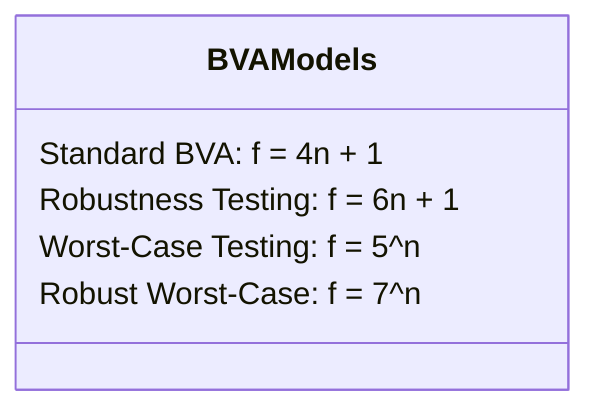

# Lý thuyết & Các Mô hình: Boundary Value Analysis (BVA)

Tài liệu này hệ thống hóa toàn bộ cơ sở lý thuyết, phân tích toán học và các mô hình ca kiểm thử biên từ bài giảng **"KCPM - Bài 4: Phân hoạch tương đương và Giá trị biên"** của ThS. Trần Thị Bích Hạnh (FIT - HCMUS).

---

## 1. Bản chất Lỗi Biên trong Công nghệ Phần mềm

Tại sao phần lớn lỗi lại tập trung ở các đường biên?
1. **Lỗi toán tử so sánh (Relational Operator Faults)**:
   - Viết nhầm giữa `<` và `<=` (ví dụ: đặc tả yêu cầu $total \ge min\_order\_amount$ nhưng code viết `if (total > min_order_amount)`).
   - Viết nhầm giữa `>` và `>=`.
2. **Lỗi Off-by-one**:
   - Vòng lặp chạy thiếu hoặc thừa 1 đơn vị ($i \le n$ thay vì $i < n$).
   - Đếm số lần thử thất bại sai lệch 1 đơn vị.
3. **Lỗi giá trị ranh giới (Incorrect Boundary Value)**:
   - Gõ nhầm hằng số biên (ví dụ: gõ 52 thay vì 25).
4. **Lỗi tràn số / Kiểu dữ liệu (Data Type Limit Faults)**:
   - Xảy ra khi số chạm giới hạn kiểu `INT32_MAX`, số âm, số 0.

### Ví dụ chứng minh từ Bài giảng:
- Đặc tả:
  - $Input < 10$: Báo lỗi
  - $10 \le Input < 25$: In ra `"Hello"`
  - $Input \ge 25$: Báo lỗi
- Nếu lập trình viên mắc lỗi viết `Input <= 25`:
  - Nếu ta kiểm thử tại giá trị biên $Input = 25$:
    - Expected output: Báo lỗi.
    - Actual output: `"Hello"`.
    - $\rightarrow$ **Phát hiện ra lỗi ngay lập tức!**
  - Nếu ta chọn giá trị nằm sâu trong miền lỗi như $Input = 54$:
    - Expected output: Báo lỗi.
    - Actual output: Báo lỗi.
    - $\rightarrow$ **Hoàn toàn KHÔNG phát hiện được lỗi!**

Điều này chứng minh kiểm thử tại các giá trị biên có **độ nhạy phát hiện lỗi cao nhất**.

---

## 2. Các Mô hình Đa biến BVA (Multi-variable BVA Formulations)

Khi một hàm hoặc chức năng phụ thuộc vào $n$ biến đầu vào, số lượng ca kiểm thử biên được tính theo các mô hình sau:

### 2.1. Standard Boundary Value Analysis
- **Công thức**: $f = 4n + 1$
- **Giả định**: Single Fault Assumption (tại một thời điểm, chỉ một biến có thể gặp sự cố ở biên, các biến còn lại hoạt động ở trạng thái bình thường).
- **Tập điểm kiểm tra cho mỗi biến**: $\{min, min^+, max^-, max\}$ (4 điểm).
- **Ca kiểm thử cộng thêm (+1)**: Ca kiểm thử danh nghĩa (Nominal point) với tất cả các biến đều lấy giá trị $nom$ ở giữa miền.
- **Tổng số**: Với $n$ biến, ta có $4 \times n + 1 = 4n + 1$ ca kiểm thử.

### 2.2. Robustness Testing
- **Công thức**: $f = 6n + 1$
- **Mục tiêu**: Kiểm tra tính bền vững (robustness) của hệ thống khi nhận giá trị nằm ngoài biên hợp lệ.
- **Tập điểm kiểm tra cho mỗi biến**: $\{min^-, min, min^+, max^-, max, max^+\}$ (6 điểm: gồm 2 điểm không hợp lệ $min^-$ và $max^+$).
- **Tổng số**: $6n + 1$ ca kiểm thử.

### 2.3. Worst-Case Testing
- **Công thức**: $f = 5^n$
- **Giả định**: Từ bỏ giả định lỗi đơn. Trong thực tế, lỗi có thể xuất hiện khi **nhiều biến đồng thời cùng đạt tới giá trị biên cực trị** (tương tác đa biến).
- **Tập điểm cho mỗi biến**: $\{min, min^+, nom, max^-, max\}$ (5 điểm).
- **Tổng số**: Tích đề các của $n$ biến $\rightarrow 5^n$ ca kiểm thử.
- *Ví dụ*: Với 2 biến: $5^2 = 25$ ca kiểm thử. Với 3 biến: $5^3 = 125$ ca kiểm thử.

### 2.4. Robust Worst-Case Testing
- **Công thức**: $f = 7^n$
- **Mục tiêu**: Toàn diện nhất, kiểm tra tổ hợp của cả các giá trị biên hợp lệ và không hợp lệ giữa các biến.
- **Tập điểm cho mỗi biến**: $\{min^-, min, min^+, nom, max^-, max, max^+\}$ (7 điểm).
- **Tổng số**: $7^n$ ca kiểm thử.

---

## 3. Cách Xác định Điểm Biên Trên các Kiểu Dữ liệu Thực tế

| Kiểu Dữ liệu | Ví dụ Nghiệp vụ | Giá trị Biên dưới (LB) | Điểm quanh LB ($LB-\epsilon, LB, LB+\epsilon$) | Giá trị Biên trên (UB) | Điểm quanh UB ($UB-\epsilon, UB, UB+\epsilon$) |
| :--- | :--- | :--- | :--- | :--- | :--- |
| **Số lượng (Integer Quantity)** | Số lượng mua $[1..99]$ | $LB = 1$ | $0, 1, 2$ | $UB = 99$ | $98, 99, 100$ |
| **Độ dài Chuỗi (String Length)** | Mật khẩu tối thiểu 8 ký tự | $LB = 8$ | $7, 8, 9$ | Không có UB cụ thể hoặc $UB = 255$ | $254, 255, 256$ |
| **Tiền tệ (Currency)** | Ngưỡng coupon $\ge 300,000$ ₫ | $LB = 300,000$ | $299,999; 300,000; 300,001$ | $UB = \text{max\_cart}$ | Giới hạn đơn hàng |
| **Bộ đếm (Counter)** | Số lần login sai trước khi khóa (3 lần) | $LB = 1$ | $0, 1, 2$ | $UB = 3$ | $2, 3, 4$ |
| **Thời gian (Timestamp / Date)** | Hạn dùng mã `expired_at` | Ngày tạo | - | `expired_at` | Trước 1s, Đúng mốc, Sau 1s |
