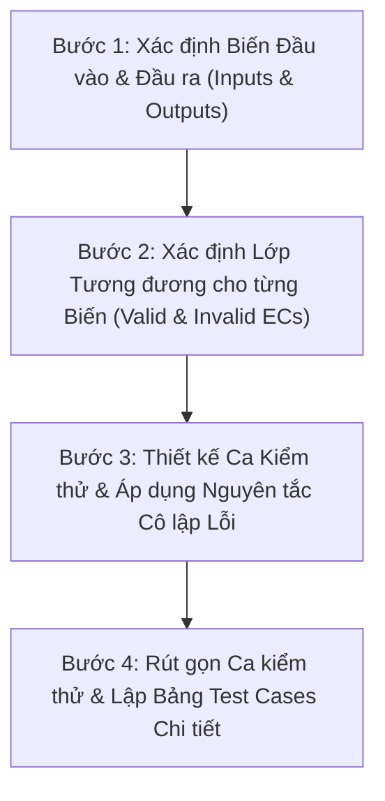

# Domain Testing Skill (Equivalence Partitioning)

Kỹ năng này hướng dẫn quy trình từng bước áp dụng kỹ thuật **Domain Testing (Phân hoạch tương đương - Equivalence Partitioning)** để thiết kế tập ca kiểm thử tối ưu, có độ phủ cao và tuân thủ nghiêm ngặt nguyên tắc **cô lập lỗi (Fault Isolation)** theo chuẩn bài giảng môn Kiểm thử Phần mềm trường ĐH Khoa học Tự nhiên (HCMUS).

---

## 1. Mục tiêu và Nguyên lý Cốt lõi

- **Mục tiêu**: Chia miền giá trị đầu vào/đầu ra thành các lớp tương đương (Equivalence Classes). Thay vì kiểm thử toàn bộ không gian giá trị (vô hạn hoặc quá lớn), ta chỉ chọn các giá trị đại diện từ mỗi lớp tương đương để kiểm thử, qua đó giảm thiểu số lượng ca kiểm thử nhưng vẫn tối đa hóa khả năng phát hiện lỗi.
- **Giả định nền tảng**: Nếu một giá trị đại diện trong lớp tương đương hoạt động đúng đắn, tất cả các giá trị khác trong cùng lớp tương đương đó cũng hoạt động đúng đắn. Ngược lại, nếu giá trị đại diện phát hiện lỗi, toàn bộ các giá trị khác trong lớp đó cũng gây ra lỗi tương tự.
- **Tính chất Heuristic**: Phân hoạch tương đương là một quá trình heuristic, đòi hỏi kiểm thử viên phải phân tích sâu sắc đặc tả chức năng, logic xử lý của hệ thống và các ranh giới xử lý ngầm định.

---

## 2. Quy trình Thực hiện 4 Bước Chuẩn hóa (Step-by-Step Procedure)

Quy trình chuẩn gồm 4 bước bắt buộc theo bài giảng:

### Bước 1: Xác định Biến Đầu vào & Đầu ra (Inputs & Outputs)
1. Đọc kỹ đặc tả chức năng (SRS / User Story / API Specification / UI Mockup).
2. Liệt kê toàn bộ các biến đầu vào ($Input_1, Input_2, \dots, Input_n$): kiểu dữ liệu, ràng buộc, trạng thái hệ thống đi kèm.
3. Liệt kê toàn bộ các kết quả đầu ra ($Output$): kết quả xử lý thành công, thay đổi trạng thái trong CSDL, thông báo lỗi (Error message, Status code).

### Bước 2: Xác định Lớp Tương đương (Equivalence Classes - EC)
Đối với từng biến đầu vào và đầu ra, xác định ít nhất 2 nhóm lớp:
- **Lớp tương đương Hợp lệ (Valid Equivalence Class)**: Tập giá trị được hệ thống chấp nhận và xử lý bình thường.
- **Lớp tương đương Không hợp lệ (Invalid Equivalence Class)**: Tập giá trị vi phạm ràng buộc mà hệ thống phải từ chối hoặc xử lý ngoại lệ.

Áp dụng các quy tắc phân hoạch theo bài giảng:
- **Dãy giá trị $[min..max]$**:
  - Valid EC: $min \le x \le max$
  - Invalid EC 1: $x < min$
  - Invalid EC 2: $x > max$
- **Tập giá trị hữu hạn rời rạc $\{A, B, C\}$**:
  - Nếu hệ thống xử lý từng giá trị theo hành vi khác nhau $\rightarrow$ Mỗi giá trị là một Valid EC riêng biệt ($EC_A, EC_B, EC_C$).
  - Invalid EC: Giá trị không thuộc $\{A, B, C\}$.
- **Ràng buộc bắt buộc ("Must be" / Định dạng / Boolean)**:
  - Valid EC: Thỏa mãn điều kiện (VD: email đúng regex, password đủ chữ hoa/thường/số/ký tự đặc biệt).
  - Invalid EC: Không thỏa mãn điều kiện.
- **Heuristic Sub-partitioning**: Nếu có cơ sở tin rằng các giá trị trong cùng 1 miền được xử lý bằng nhánh `if-else` khác nhau (ví dụ: số âm, số 0, số dương; hoặc chuỗi rỗng vs chuỗi có ký tự trắng), hãy chia thành các lớp tương đương con.

Đánh số định danh cho từng lớp: $EC_1, EC_2, EC_3, \dots$ Lập **Bảng tổng hợp Lớp tương đương**.

### Bước 3: Thiết kế Ca Kiểm thử & Áp dụng Nguyên tắc Cô lập Lỗi (Fault Isolation)
Khi ghép các giá trị đại diện của các biến vào từng ca kiểm thử, **BẮT BUỘC** tuân thủ 2 nguyên tắc vàng:

> [!IMPORTANT]
> **2 NGUYÊN TẮC VÀNG THIẾT KẾ TEST CASE:**
> 1. **Phủ Lớp Hợp lệ (Valid ECs)**: Chọn các giá trị sao cho **một ca kiểm thử bao phủ càng nhiều lớp tương đương hợp lệ càng tốt** cho đến khi tất cả các lớp hợp lệ đều được kiểm thử ít nhất một lần. (Mục đích: Tối ưu số lượng test case).
> 2. **Cô lập Lớp Không hợp lệ (Invalid ECs - Fault Isolation)**: **Tại một thời điểm, một ca kiểm thử CHỈ ĐƯỢC PHỦ ĐÚNG 1 LỚP TƯƠNG ĐƯƠNG KHÔNG HỢP LỆ CỦA 1 BIẾN**. Tất cả các biến còn lại BẮT BUỘC phải lấy giá trị thuộc lớp tương đương hợp lệ! (Mục đích: Nếu test case fail hoặc báo lỗi, ta biết chính xác 100% lỗi do biến không hợp lệ nào gây ra, tránh hiện tượng lỗi của trường này che khuất lỗi của trường khác).

### Bước 4: Rút gọn Ca kiểm thử & Hoàn thiện Bảng Test Cases
1. Lập bảng kiểm thử tổng thể đầy đủ.
2. Kiểm tra các test case hợp lệ bị trùng lặp input hoặc hành vi để gộp lại thành **Bảng rút gọn các ca kiểm thử** (như Slide 18 của bài giảng).
3. Mỗi ca kiểm thử hoàn chỉnh phải có:
   - **Test Case ID** (VD: `DT_FR09_TC01`)
   - **Tên/Mô tả Mục đích** (Test Objective)
   - **Lớp tương đương được bao phủ** (Covered ECs: VD `EC1, EC5, EC8`)
   - **Dữ liệu đầu vào chi tiết** (Test Inputs)
   - **Kết quả mong đợi** (Expected Output: HTTP Status, UI message, DB update)
   - **Tiền điều kiện & Các bước thực hiện** (Preconditions & Test Steps)

---

## 3. Cấu trúc Tài liệu & Thư mục Đi kèm

Trong thư mục skill này:
- [ lý thuyết và quy tắc chi tiết](references/theory_and_rules.md): Phân tích sâu thuật ngữ, quy tắc heuristics và nền tảng lý thuyết từ bài giảng HCMUS.
- [Biểu mẫu Test Case Domain Testing](resources/domain_testing_template.md): Mẫu bảng Markdown tiêu chuẩn để sinh viên/agent điền trực tiếp vào báo cáo bài tập.
- [Ví dụ Minh họa Toàn diện trên EShop](examples/coupon_domain_testing_example.md): Áp dụng mẫu kỹ thuật vào chức năng Mã giảm giá (FR-09) và Đăng ký (FR-01) của EShop SUT.
