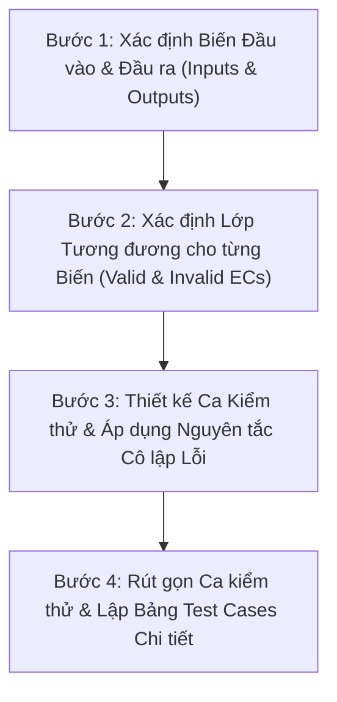

# Domain Testing Skill (Equivalence Partitioning)

Kỹ năng này hướng dẫn quy trình từng bước áp dụng kỹ thuật **Domain Testing (Phân hoạch tương đương - Equivalence Partitioning)** để thiết kế tập ca kiểm thử tối ưu, có độ phủ cao và tuân thủ nghiêm ngặt nguyên tắc **cô lập lỗi (Fault Isolation)** theo chuẩn bài giảng môn Kiểm thử Phần mềm trường ĐH Khoa học Tự nhiên (HCMUS).

---

## 1. Mục tiêu và Nguyên lý Cốt lõi

- **Mục tiêu**: Chia miền giá trị đầu vào/đầu ra thành các lớp tương đương (Equivalence Classes). Thay vì kiểm thử toàn bộ không gian giá trị (vô hạn hoặc quá lớn), ta chỉ chọn các giá trị đại diện từ mỗi lớp tương đương để kiểm thử, qua đó giảm thiểu số lượng ca kiểm thử nhưng vẫn tối đa hóa khả năng phát hiện lỗi.
- **Giả định nền tảng**: Nếu một giá trị đại diện trong lớp tương đương hoạt động đúng đắn, tất cả các giá trị khác trong cùng lớp tương đương đó cũng hoạt động đúng đắn. Ngược lại, nếu giá trị đại diện phát hiện lỗi, toàn bộ các giá trị khác trong lớp đó cũng gây ra lỗi tương tự.
- **Tính chất Heuristic**: Phân hoạch tương đương là một quá trình heuristic, đòi hỏi kiểm thử viên phải phân tích sâu sắc đặc tả chức năng, logic xử lý của hệ thống và các ranh giới xử lý ngầm định.

---

## 2. Quy trình Thực hiện 4 Bước Chuẩn hóa (Step-by-Step Procedure)

Quy trình chuẩn gồm 4 bước bắt buộc theo bài giảng:

### Bước 1: Xác định Biến Đầu vào & Đầu ra (Inputs & Outputs)
1. Đọc kỹ đặc tả chức năng (SRS / User Story / API Specification / UI Mockup).
2. Liệt kê toàn bộ các biến đầu vào ($Input_1, Input_2, \dots, Input_n$): kiểu dữ liệu, ràng buộc, trạng thái hệ thống đi kèm.
3. Liệt kê toàn bộ các kết quả đầu ra ($Output$): kết quả xử lý thành công, thay đổi trạng thái trong CSDL, thông báo lỗi (Error message, Status code).

### Bước 2: Xác định Lớp Tương đương (Equivalence Classes - EC)
Đối với từng biến đầu vào và đầu ra, xác định ít nhất 2 nhóm lớp:
- **Lớp tương đương Hợp lệ (Valid Equivalence Class)**: Tập giá trị được hệ thống chấp nhận và xử lý bình thường.
- **Lớp tương đương Không hợp lệ (Invalid Equivalence Class)**: Tập giá trị vi phạm ràng buộc mà hệ thống phải từ chối hoặc xử lý ngoại lệ.

Áp dụng các quy tắc phân hoạch theo bài giảng:
- **Dãy giá trị $[min..max]$**:
  - Valid EC: $min \le x \le max$
  - Invalid EC 1: $x < min$
  - Invalid EC 2: $x > max$
- **Tập giá trị hữu hạn rời rạc $\{A, B, C\}$**:
  - Nếu hệ thống xử lý từng giá trị theo hành vi khác nhau $\rightarrow$ Mỗi giá trị là một Valid EC riêng biệt ($EC_A, EC_B, EC_C$).
  - Invalid EC: Giá trị không thuộc $\{A, B, C\}$.
- **Ràng buộc bắt buộc ("Must be" / Định dạng / Boolean)**:
  - Valid EC: Thỏa mãn điều kiện (VD: email đúng regex, password đủ chữ hoa/thường/số/ký tự đặc biệt).
  - Invalid EC: Không thỏa mãn điều kiện.
- **Heuristic Sub-partitioning**: Nếu có cơ sở tin rằng các giá trị trong cùng 1 miền được xử lý bằng nhánh `if-else` khác nhau (ví dụ: số âm, số 0, số dương; hoặc chuỗi rỗng vs chuỗi có ký tự trắng), hãy chia thành các lớp tương đương con.

Đánh số định danh cho từng lớp: $EC_1, EC_2, EC_3, \dots$ Lập **Bảng tổng hợp Lớp tương đương**.

### Bước 3: Xác định Ca Kiểm thử Sơ bộ & Cô lập Lỗi (Full Preliminary Test Cases Table)
> [!IMPORTANT]
> **YÊU CẦU BẮT BUỘC Ở BƯỚC 3 (THEO SLIDE 17 BÀI GIẢNG FIT - HCMUS):**
> 1. **Duyệt đầy đủ toàn bộ 100% các lớp tương đương (Brute-force coverage)**: Phải lập bảng sơ bộ có số dòng bằng đúng tổng số lớp tương đương ($EC_1, EC_2, \dots, EC_n$). Không được gộp dòng sớm hay bỏ sót bất kỳ EC nào ở bước này.
> 2. **Giá trị cụ thể cho từng cột**: Tuyệt đối **KHÔNG** dùng các từ mô tả chung chung như *"Giá trị hợp lệ 1"*, *"Giá trị hợp lệ 2"*. Phải điền **giá trị dữ liệu thực tế** (số cụ thể, chuỗi cụ thể) cho mọi biến.
> 3. **Nguyên tắc Cô lập lỗi (Single Fault Assumption)**:
>    - Khi dòng đó kiểm tra một lớp tương đương không hợp lệ ($EC_{invalid}$) của biến $X$, biến $X$ nhận giá trị đại diện của $EC_{invalid}$.
>    - **TẤT CẢ các biến còn lại BẮT BUỘC nhận giá trị đại diện HỢP LỆ CỤ THỂ** đã chọn ở Bước 2.
>    - Điều này đảm bảo nếu ca kiểm thử thất bại, ta khẳng định chính xác 100% nguyên nhân do biến $X$ gây ra, không bị che khuất lỗi.
> 4. **Xác định kết quả mong đợi cụ thể**: Ghi rõ mã HTTP, thông báo lỗi hoặc dữ liệu phản hồi tương ứng cho từng dòng.

### Bước 4: Rút gọn Ca kiểm thử & Lập Bảng Đặc tả Chi tiết (Test Reduction)
1. **Phân tích trùng lặp**: Xác định các dòng kiểm thử lớp hợp lệ ở Bước 3 có cùng toàn bộ giá trị input và cùng kết quả mong đợi.
2. **Gộp ca kiểm thử hợp lệ (Slide 18 bài giảng)**: Gom các dòng trùng lặp thành **1 Ca kiểm thử hợp lệ tổng hợp duy nhất** bao phủ đồng thời tất cả các lớp tương đương hợp lệ đó.
3. **Giữ nguyên ca kiểm thử không hợp lệ**: Mỗi ca kiểm thử không hợp lệ độc lập vẫn được giữ nguyên một dòng riêng để bảo toàn khả năng cô lập lỗi.
4. **Bảng đặc tả hoàn chỉnh**: Trình bày rõ:
   - **Test Case ID** (VD: `DT_FR09_TC01`)
   - **Lớp tương đương được bao phủ** (Covered ECs: VD `EC01, EC05, EC07, EC09, EC11, EC13, EC15`)
   - **Dữ liệu đầu vào chi tiết** (Concrete inputs)
   - **Kết quả mong đợi** (Expected Output: HTTP Status, UI message, DB update)
   - **Tiền điều kiện & Các bước thực hiện** (Preconditions & Test Steps)

---

## 3. Cấu trúc Tài liệu & Thư mục Đi kèm

Trong thư mục skill này:
- [ lý thuyết và quy tắc chi tiết](references/theory_and_rules.md): Phân tích sâu thuật ngữ, quy tắc heuristics và nền tảng lý thuyết từ bài giảng HCMUS.
- [Biểu mẫu Test Case Domain Testing](resources/domain_testing_template.md): Mẫu bảng Markdown tiêu chuẩn để sinh viên/agent điền trực tiếp vào báo cáo bài tập.
- [Ví dụ Minh họa Toàn diện trên EShop](examples/coupon_domain_testing_example.md): Áp dụng mẫu kỹ thuật vào chức năng Mã giảm giá (FR-09) và Đăng ký (FR-01) của EShop SUT.
